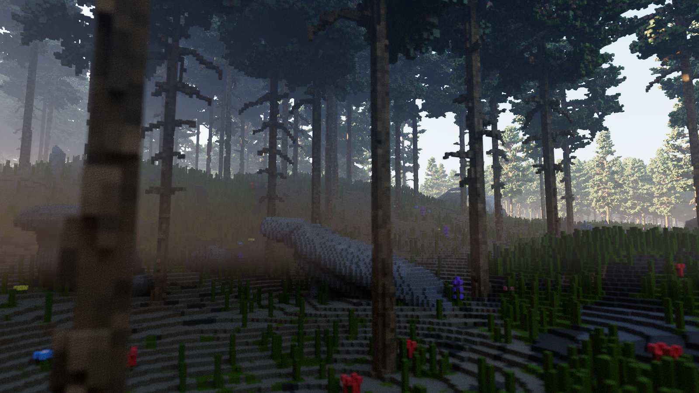
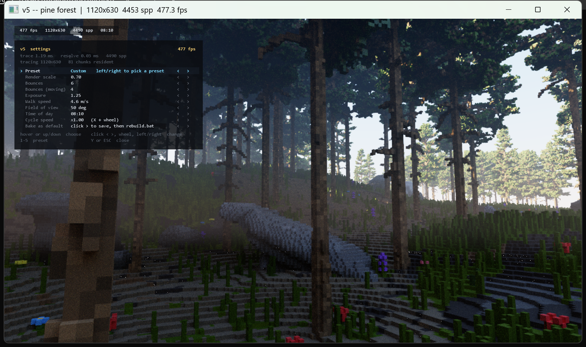
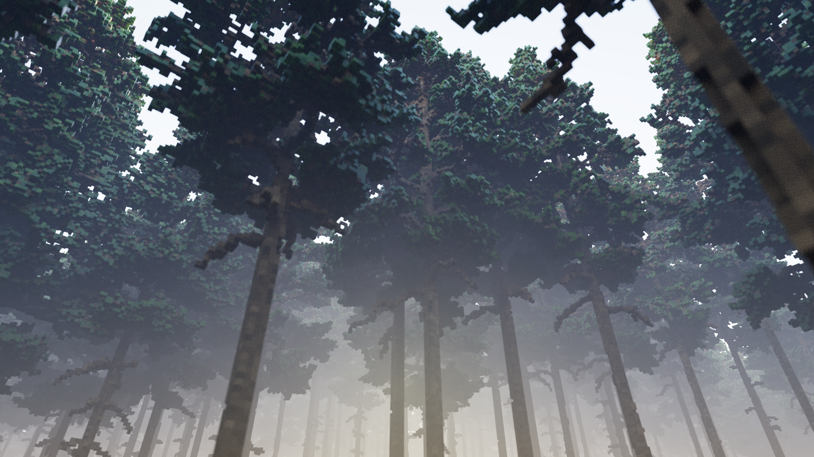

# v2 — an endless voxel pine forest, path traced on OptiX



A GPU path tracer built on **NVIDIA OptiX 9**. The world is 10 cm voxels — the
same grid the `pine_1..9.vox` assets are authored on, so a trunk stands in
ground made of the lattice it is made of — and it goes on as far as you care to
walk. You walk it as a person: 18 voxels to the eye, gravity, a jump, and a head
bob.

```
v2.bat                            walk around in the wood
v2.bat --seed 7 --density 0.8     a different, thicker wood
v2.bat --view 8                   a smaller resident ring
v2.bat --out shot.png --spp 256   render one frame offline and exit
v2.bat --help                     every option
```

## Controls

| | |
|---|---|
| `W A S D` | walk (hold shift to sprint) |
| space | jump |
| **`F`** | toggle fly mode |
| **`Y`** | the settings menu — it frees the mouse so you can click |
| left click | capture the mouse and look freely (ESC gives it back) |
| right-drag | look around without capturing |
| scroll | zoom (field of view) |
| arrow keys | scrub the day/night clock (up/down = fast) |
| **`X` + scroll** | day/night speed — scroll **down** past the slowest notch to run time **backwards** |
| `-` / `=` | exposure down / up |
| `[` / `]` | bounces down / up |
| `P` | screenshot &nbsp;&nbsp; `F1` help |
| `ESC` | release the mouse; **ESC again quits** |

ESC always takes two presses. A rule that is only sometimes true is worse than
one that is never true, and it is the half-remembered one that loses the render
you were part way through.

## There is no denoiser

Every mode of the OptiX AI denoiser was built, tuned and then removed. On a
voxel canopy the spatial models turn thousands of needle-sized faces to felt,
and the temporal ones lag a moving camera. What replaces it is nothing clever:
brute-force accumulation on a card fast enough to trace hundreds of samples a
second, a Halton (2,3) jitter so those samples land somewhere useful, and a
rolling window so a moving sun does not invalidate the film.

Standing still, the image converges to something clean in well under a second.

`NRD`, `RTXTS` and `vk_denoise_dlssrr` were all evaluated. See *The libraries
that did not fit*, below — the short version is that NRD has no CUDA backend at
all, and that is not something a fork or a newer version changes.

## The world

**Endless, in chunks of 25.6 m.** A ring of them follows the camera; the default
radius of 12 keeps 625 resident, about 600 m across. Three things make that
affordable, and they are the whole design:

1. **The world is a pure function.** `heightM(x, z)` depends on nothing but its
   arguments, so a chunk can be meshed by any thread at any time with no shared
   state and no locking. Nothing is *generated* in the sense of being decided
   and stored — it is recomputed, identically, whenever it is needed. That is
   also why evicting a chunk is safe: rebuilt an hour later it is the same
   chunk.
2. **Meshing runs on worker threads, structure builds run budgeted on the main
   one.** Meshing is 65k columns of noise and parallelises perfectly; building
   the acceleration structure has to happen on the thread that owns the CUDA
   context, so that half is capped per frame. Crossing a chunk boundary costs a
   few frames of catch-up rather than one long stall.
3. **The shader binding table has fixed chunk slots.** A resident chunk owns one
   record for the life of its residency and hands it on when evicted, so only
   32 bytes are rewritten when the ring moves.

**What grows on it.** Nine pine models, twenty-six rocks, six flowers, all
instanced — one acceleration structure per model, referred to through a
transform, so thousands of trees cost the memory of nine. Rotations are exact
quarter turns: an arbitrary yaw would put a voxel model off the lattice its own
faces are aligned to, and the crisp axis-aligned silhouette that makes a voxel
tree look like a voxel tree would turn into stair-stepped mush.

**The ground borrows the trees' palette.** Grass and soil colours are sampled
from the greens and browns the pine models actually use — spread across the
foliage entries rather than taken consecutively, because adjacent MagicaVoxel
entries are usually one hue's shading ramp. Soil candidates are filtered to warm,
mid-dark, unsaturated colours: `forModelColor` classifies by green dominance, so
"bark" really means "everything else", and sampling a pine's red cut-ends and
near-white highlights as soil painted scarlet and chalk patches across whole
hillsides.

Flowers grow in **colonies** — a low-frequency field says where, a jittered grid
still says how far apart. A uniform scatter at the same density reads as
wallpaper.

## The person

Ported from the JS engine's `sim/player.js` rather than invented, because that
feel was already tuned. It converts exactly: that engine measures in **voxels**
and this one in **metres**, and a voxel is 10 cm.

| | JS (voxels) | v2 (metres) |
|---|---:|---:|
| walk | 46 /s | 4.6 m/s |
| sprint | ×1.85 | 8.5 m/s |
| jump | 66 /s | 6.6 m/s → ~1.1 m |
| gravity | 200 /s² | 20 m/s² |
| eye | 18 | **1.80 m** |

Gravity is 20 m/s², not 9.81. Real gravity gives the right arc but takes twice
as long, and the hang time reads as floating.

**The ground is queried, not traced.** The terrain is a height field and a pure
function of position, so the surface under the feet is a direct evaluation —
sampled at the four body corners, highest wins, so half the player cannot sink
into a step they are standing against. Being a query rather than a ray also
means you can walk into terrain the renderer has not meshed yet without falling
through the world. Step-up and step-down are both 0.62 m: without the first,
every 10 cm lip stops you; without the second, walking downhill is a series of
tiny falls.

**The head bob is one dip per stride**, not per footfall. `cos(phase * 2)` is
what a real head does and it reads as jitter at this cadence; `cos(phase)` reads
as a gait. The amplitude is eased rather than switched, so starting and stopping
ramp it in and out, and sprinting is the same curve pushed further rather than a
second rule. It is added to the eye only — physics and ground contact never see
it.

**Trees and rocks are not solid.** They are instanced models with no
representation in the height field; colliding with them would mean tracing
against the acceleration structure, which is a different and much larger job.

## The settings menu



`Y` opens it and hands the mouse back, so you can point at the settings. Closing
it takes the mouse again if it had it. A menu you can see but not point at is
worse than no menu, and a cursor that stays hidden while a panel asks to be
clicked reads as the window having locked up.

| | |
|---|---|
| hover, or up/down | choose a row |
| click `<` / `>`, wheel, or left/right | change the value |
| `1`–`5` | jump straight to a preset |
| click off the panel | dismiss it |

The last row, **Bake as default**, writes the live settings out as
`src/core/defaults.h`. Run **`rebuild.bat`** and that is what v2 opens with — so
the menu and the command line stop being separate universes: walk around, tune
until it looks right, bake, rebuild. Precedence is struct default → baked
default → command-line flag, so a flag still wins.

It writes **source**, not a config file, deliberately. A config read at startup
is one more thing that can be stale, missing, or disagree with the flags; a
header is visible in the diff and costs nothing at runtime.

Two details that only matter when they are wrong. The `<` and `>` steppers are
drawn on **every** row — a click target that appears only once you have hit it
is not a target. And a click acts on the position tracked by the cursor callback
rather than a fresh `glfwGetCursorPos`: the two agree for a real mouse, but only
the tracked one is guaranteed to be the position that produced the highlight on
screen, so a click always does what the highlight says it will.

The panel is its own texture at **window** resolution, not composited into the
frame — the frame is rendered at `--scale` and stretched, so at 0.25 anything
drawn into it is magnified four times and the menu would be blurrier than the
render behind it. Its text comes from GDI rather than a baked glyph table: this
engine already links gdi32, and a kilobyte of hex font data is unreadable in
source and silently wrong if one byte is off.

## What it costs

RTX 4070, 625 chunks resident, 55.8 M triangles, ~30 700 instances.

| | |
|---|---:|
| world prime, from cold | 1.2 s |
| of which GPU structure building | ~1.0 s |
| video memory | 5.0 GB |
| walking, 1120×630 | 500–850 fps |
| walking, 2674×1393 maximised | 110–150 fps |
| offline, 1920×1080 × 64 spp | 0.26 s |

**Render distance is nearly free at trace time.** Going from a radius-6 ring to
radius-12 — four times the geometry — changed the frame rate not at all, because
BVH traversal is logarithmic in scene size. It costs prime time and memory, and
nothing else.

### The meshing optimisations that mattered

Measured, not guessed, and two of three guesses were wrong.

**`topMaterial` was recomputing the terrain height four times per column.** It
differenced its four neighbours to get a slope, and each of those is a full
`heightM` — about 23 octaves of value noise. Every column therefore cost *five*
height evaluations when the mesher already had all five in the grid it had just
filled. Passing the slope in makes it one. That needs the height grid padded by
**two** and the material grid by one: the material at a column one outside the
chunk needs that column's slope, which reaches one further again.

**Faces are merged into runs.** A top face only needs its own quad where
something *changes* — a step in height or a change of material — and everywhere
else a run of columns is one flat rectangle. Walls merge along their own axis: an
east-facing wall runs north–south, so it merges along z, and a run continues
while column height, neighbour height and surface material all hold, because
those three are exactly what decide where the material bands split. Together:
**33.9 M → 17.8 M** triangles at radius 6, and **66.5 M → 55.8 M** at radius 12.

**What did not help:** batching the structure builds so 48 chunks share two
device synchronisations instead of 96, and deferring the IAS rebuild during
priming. Both were near-zero. Instrumenting showed why — the prime is **BVH
construction throughput bound** (~60 M tris/s on this card), not latency bound.
The only lever left is emitting fewer triangles, which is what the merging does.

The next real step would be LOD: 73% of the chunks are beyond radius 6, and
meshing those at half voxel resolution would cut their triangles ~4×. It needs
seam handling between detail levels and re-meshing as the camera approaches,
which is why it is not here rather than half-done.

## Building

Needs **Visual Studio** with "Desktop development with C++", the **CUDA
toolkit** and the **OptiX SDK**. GLFW is vendored under `external/glfw`, so
there is nothing else to install, no cmake, and no package manager.

```bat
build.bat           :: build
build.bat clean     :: throw everything away, vendored GLFW included
```

`rebuild.bat` does the same from Explorer, which is what applies a bake.
`OPTIX_PATH` and `CUDA_PATH` override where those are looked for.

### One compiler, not two

`nvcc` compiles the device half, and on Windows it can only drive **MSVC** as
its host compiler. The host half is MSVC as well, so `cl.exe` is now simply
*the* compiler rather than a dependency that nothing links against.

It was MinGW g++ until September 2026. That built a working engine for months,
but it ruled out every denoiser NVIDIA makes — NRD, RTXTS and DLSS-RR all ship
as MSVC C++ with an MSVC ABI, and MinGW's linker cannot consume those. It also
produced an exe that was **not standalone**: it pulled `glfw3.dll` and
`libwinpthread-1.dll` out of msys64 and only ran on a machine with MSYS2
installed and on `PATH`. The MSVC build imports nothing but system DLLs, and
`/MT` means it carries the CRT rather than needing a redistributable.

The engine's own code needed **no changes** to move — it compiled clean under
`cl` on the first attempt. The only thing MinGW was really supplying was
msys64's `libglfw3.a`, a MinGW-ABI library `cl` cannot link. Hence
`external/glfw`: GLFW 3.4's Win32 subset, 21 `.c` files compiled here directly.
GLFW supports exactly this, which is why vendoring it needs no build system.

The two builds were compared pixel for pixel at 400×225, 64 spp. 224 pixels of
90,000 differ, isolated and scattered across the whole frame — only 4% have a
differing neighbour — and 9 of them by more than 16/255. That is fast-math
rounding at silhouette edges rather than a difference in the render; a moved
instance would have been a contiguous blob. Each binary is bit-identical to
itself run to run.

v2 links the CUDA **driver** API (`cuda.lib`), not the runtime, which is why it
calls `cuMemAlloc` and `cuLaunchKernel` rather than `cudaMalloc` and `<<<>>>`.
`cuda.lib` is a static loader shim rather than an import library, so
`nvcuda.dll` does not appear in the exe's imports — it is opened on demand.

OptiX needs **no library at all** at link time: `optix_stubs.h` loads
`nvoptix.dll` out of the driver store at runtime. `cfgmgr32` and `advapi32` are
in the link line for that search — it walks the configuration manager for the
display device, then reads the driver's path out of the registry.

Two artefacts land beside the exe and are loaded from disk at startup:
`v2.optixir` (the OptiX programs) and `tonemap.ptx` (the display kernel). A
shader change is one `nvcc` call and a relaunch, with no host relink.

## How it fits together

```
src/core/      vecmath.h        Vec3, frames, PCG32, sampling, Halton
                                -- compiled for BOTH host and device
               noise.h          fbm, ridged, warped -- terrain basis
               defaults.h       GENERATED by "Bake as default"
               image.h/.cpp     PNG and PFM out

src/scene/     vox.h            MagicaVoxel reader, single- and multi-model
               voxelworld.h     the 10 cm world, meshed to exposed faces
               material.h       diffuse + GGX + translucency, and water
               sky.h            Preetham, split host-fit / device-eval
               daynight.h       the clock, ported from the JS engine

src/optix/     params.h         the host/device contract
               v2.cu            raygen, miss, closest-hit -- the integrator
               tonemap.cu       ACES + sRGB, a plain CUDA kernel

src/gpu/       cuda_util.h      driver-API helpers, RAII device memory
               pipeline.h       context, module, programs, SBT
               chunks.h         the mesher pool and per-chunk scatter
               scene_gpu.h      models, chunk residency, the IAS
               renderer.h       the film and one frame

src/render/    camera.h         thin lens, flattened for the raygen
               player.h         walk, sprint, jump, head bob
               menu.h           the settings panel and its presets
               overlay.h        GDI text into a GL texture
               viewer.h         GLFW, input, the frame loop
```

### Decisions worth knowing

**The path loop lives in raygen, not in closest-hit.** The natural OptiX
translation of a recursive CPU tracer is for closest-hit to shade and trace the
next ray itself, and it is the wrong one: recursion costs continuation stack, and
OptiX must size that stack for the deepest path *any* launch might take, for
every thread in flight. Flattening the loop makes the trace depth 1 whatever the
path length.

**Shadow rays have no hit program at all.** They are traced with closest-hit and
any-hit both disabled and `TERMINATE_ON_FIRST_HIT` set, so the only program that
can run is the miss. The payload starts at *occluded* and only the miss clears
it. In a conifer canopy, where most shadow rays die in the first metre of
foliage, that is most of the frame.

**The face direction is stored, not recomputed.** OptiX will hand back a
geometric normal via `optixGetTriangleVertexData`, but only on a structure built
with random vertex access — which costs memory everywhere to recompute a cross
product for a face that was axis-aligned when it was emitted. One byte per
triangle, packed with the material into a `uint16`, and the normal is exact by
construction.

**Every acceleration structure is compacted.** OptiX builds into a
conservatively sized buffer and says afterwards how much it actually needed; for
millions of small coplanar quads the compacted form is routinely half the size.

**Two counters, and they mean different things.** `frame` is the accumulation
index and resets when the camera moves; `tick` only ever increases and seeds the
sampler and the jitter. Conflating them was a real bug — it froze the jitter at
Halton(0) for the whole time the camera was moving.

**The stats are measured with CUDA events, not a host clock.** Every call in a
frame is asynchronous, so a host timer measures how long the CPU took to *submit*
the work — unless something happens to synchronise, in which case it measures the
whole frame. The same line was reporting both, differing by three orders of
magnitude.

## The libraries that did not fit

This engine was asked for on top of several NVIDIA libraries. Recording what
each turned out to be is more useful than a quiet substitution.

| | what it is | outcome |
|---|---|---|
| **OptiX SDK** | ray tracing on the RT cores | ✅ the engine is built on it |
| **NVIDIA-RTX/RTXTS** | RTX Texture **Streaming** — DX12 sampler feedback. Not a denoiser | ❌ a voxel world has no textures to stream |
| **NVIDIA-RTX/NRD** | real-time denoisers — the right library to want | ❌ see below |
| **vk_denoise_dlssrr** | a Vulkan DLSS-RR sample; fetches nvpro_core2 and the NGX SDK at configure time | ❌ only the sample source is on disk |
| **gvdb-voxels** | sparse voxel database | ❌ its OptiX bridge targets the OptiX 6 API, deleted in 7.0 |

**NRD**, specifically, because it keeps coming up and because the blocker is not
about which copy you have:

* **No CUDA backend.** Not one file in the repository mentions CUDA. It hands
  you a list of compute-shader dispatches to run, and its README is explicit:
  D3D12, Vulkan or D3D11. v2 has no graphics device — OptiX is CUDA, and the only
  GL context here exists to blit one texture.
* `cudaGraphicsGLRegisterImage` is the wrong end of it: that is CUDA↔OpenGL, and
  NRD does not support OpenGL. Sharing would have to be CUDA↔D3D12 external
  memory plus shared fences.
* ~~**The host compiler.**~~ **Cleared, September 2026.** NRD builds as an MSVC
  C++ library with a `nrd::` API, and MinGW could not link MSVC C++ symbols.
  The host build has since moved to MSVC and GLFW is vendored, so this one is
  gone. It was the only blocker that could be removed without touching the
  renderer, which is why it went first — the two below remain.
* **The integrator would change shape.** NRD wants demodulated diffuse and
  specular as separate signals, each with hit distance, in its own packing, plus
  normal+roughness in `NRD_NORMAL_ENCODING` and viewZ. v2 emits one combined
  radiance buffer.

## The assets

Nine pines at `C:/voxelbit/game/assets/foilage/pine9/pine_1..9.vox`, 22.5 m tall
at 10 cm voxels. Twenty-six rocks and `flowers.vox` under
`C:/voxelbit/game/assets/decoration/`. `--pines` and `--decor` point elsewhere;
`C:\voxelbit\v2.bat` passes both explicitly so a build from anywhere finds them.


