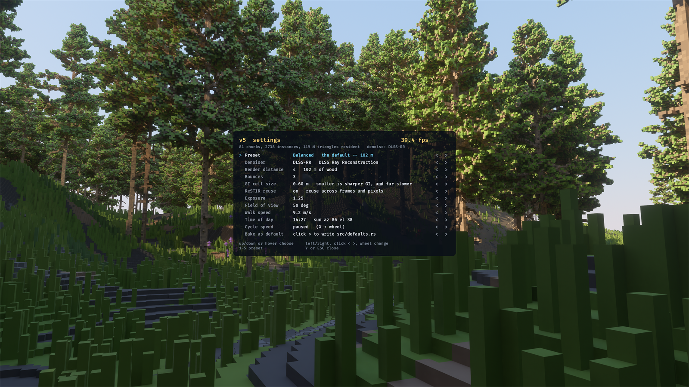

# v5 — an endless voxel pine forest, ray traced on Bevy Solari, denoised by DLSS-RR

The same world [v2](../v2) renders, through a different **kind** of renderer.

v2 path traces on OptiX and converges by brute force. A still camera accumulates
and looks superb; a moving one is permanently back to one sample per pixel, so
walking through the wood crawls with noise. Every mode of the OptiX denoiser was
tried on it and removed. That is the right trade for a frame you are going to
wait for, and the wrong one for a frame you are going to walk through — OptiX is
a rendering API, not a game one.

v5 makes the opposite trade:

- **[Bevy Solari](https://github.com/bevyengine/bevy/tree/main/crates/bevy_solari)**
  — ReSTIR direct and indirect lighting at about one ray per pixel, designed to
  be reused across frames and across neighbouring pixels rather than averaged
  over time.
- **NVIDIA DLSS Ray Reconstruction** — a temporal denoiser trained on exactly
  that signal, taking the depth, normal, roughness and motion-vector guide
  buffers Solari already writes for it, and upscaling at the same time so the
  tracer runs at a fraction of the output pixels.

Everything else — terrain, trees, rocks, flowers, the player, the day/night
cycle, the controls — is a port of v2.

| image | what it is |
|---|---|
| `images/v5_day.png` | mid-afternoon, DLSS-RR on — **43.8 fps** |
| `images/v5_nodlss.png` | the same frame, `--no-dlss` — the raw ReSTIR signal, **23.0 fps** |
| `images/v5_dawn.png` | 06:36, sun 7.5° up |
| `images/v5_golden.png` | 17:36, sun 5° up — warm rim light on the canopy tops |
| `images/v5_night.png` | 20:12, sun below the horizon |
| `images/v5_walk.png` | deep under the canopy, part-way through a `--walk` |
| `images/menu.png` | the `Y` settings menu |

Those first two rows are the whole argument for this engine in one A/B. DLSS-RR
is not a filter bolted on top of a finished picture — it lets the tracer run at a
fraction of the output pixels, so the denoised frame is both far cleaner **and**
1.9× faster than the noisy one.

---

## Running it

```
v5.bat                        walk around in the wood
v5.bat --no-dlss              the raw ReSTIR output, to compare
v5.bat --view 6               a bigger resident ring (costs fps)
v5.bat --time 19 --cycle 60   an evening, running fast
v5.bat --shot shot.png        settle, write a png and exit
v5.bat --walk 9.2             walk forward by itself
v5.bat --help                 every option
```

**Controls.** `Y` opens the **settings menu** (below). `W A S D` walk, shift
sprints, space jumps, `F` toggles fly, `Q`/ctrl descends. Click to capture the
mouse; right-drag looks without capturing. `X` + wheel sets the day/night speed
— scroll *down* past the slowest notch to run time backwards; the wheel on its
own does nothing. Arrow keys scrub the clock (up/down are the fast ones), `P`
pauses it, `H` toggles the fps counter, `F1` prints the controls, and `ESC` closes
the menu, then releases the mouse, then quits.

## The settings menu, on `Y`



Every knob in it is also a launch flag, and that is the point: the flags are
unusable as a way to **find** a setting, because choosing between them means
knowing the answer already. Quitting, editing a command line and reloading 150
million triangles to try one number is not a way to learn what the number does.
In the menu the change lands on the next frame and the fps counter at the top
reacts, so the trade is visible while you make it. It is centred on screen and
frees the mouse while it is open.

Up/down or hover chooses a row; left/right, a click on `<` `>`, or the wheel
changes it. `1`–`5` jump to a preset. The last row **bakes the current settings
into `src/defaults.rs`** so the thing you tuned is what v5 opens with — it edits
the constants in place and leaves every comment in the file alone, so the
reasoning stays where it was written.

Rows that would need the world rebuilt — seed, densities, asset paths — are
deliberately absent, as they were in v2. A menu that silently does nothing is
worse than one that does not offer the control.

`--walk` is worth knowing about. It drives the player forward on a fixed path,
and it exists because the question a denoiser has to answer is about **motion** —
a still frame is easy, and comparing two hand-flown screenshots compares two
different views as much as two denoiser settings. It feeds the same input the W
key does, so gravity, step-up, solid trunks and the head bob all still apply.

## Building it

```
build.bat
```

Needs, all build-time only and all already wired into `.cargo/config.toml`:

- **Rust** (rustup) — the engine is Rust; Bevy is a path dependency on the local
  `C:/Users/mrwbh/bevy` checkout (0.20.0-dev), because `bevy_solari` is not in
  any released version.
- **Vulkan SDK** (`VULKAN_SDK`) — headers only. DLSS is a Vulkan feature and its
  bindings are generated against `vulkan.h`; the loader itself ships with the
  driver.
- **libclang** (`LIBCLANG_PATH`) — bindgen parses those headers.
- **DLSS SDK** (`DLSS_SDK`) — not redistributable, referenced in place.

`build.bat` also copies `nvngx_dlss.dll` and `nvngx_dlssd.dll` next to the exe.
**That step is not optional and its absence is silent:** the NGX models load at
runtime from beside the executable, and without them v5 builds, links, runs, and
reports *"DLSS is not supported on this system"* on a machine where it is
perfectly well supported.

---

## The four places the port could not be literal

Most of v2 came across unchanged. Four things could not, and each one is a
consequence of Solari being a real-time hybrid rather than a path tracer.

### 1. There is no sun light. The sun is geometry.

Solari lights a scene from `DirectionalLight`s and **emissive triangles**. It has
no environment map, no sky model and no miss shader — a ray that escapes the
world contributes exactly zero. v2 evaluated Preetham in its OptiX miss program,
and on a forest floor that sky term is most of the light, because the canopy
blocks the sun over nearly all of the ground. Ported without a sky, this world
has black shadows, a black canopy interior, and nothing at all at dusk.

So the sky is a **shell around the camera** whose emissive map is the Preetham
fit, re-baked whenever the sun moves ([`sky.rs`](src/scene/sky.rs)), picked up as
an area light through the same path as any emissive mesh.

And that shell **cannot coexist with a `DirectionalLight`**. Solari's shadow ray
for a directional light runs to `RAY_T_MAX` — 100 km — with the cull mask wide
open, so any geometry in the way blocks it, and a shell around the camera is in
the way of every ray that leaves it. A sun light plus a sky shell is a
permanently eclipsed sun. Moving the shell beyond 100 km does not help either:
the same constant bounds the indirect rays, so a shell out there is unreachable
and lights nothing.

The resolution is to stop treating the sun as a special case: it is a disk of
sky, so it is emissive geometry too, sized to the real 0.53°. Solari picks a
light source uniformly, so with exactly two of them the sun and the sky each get
half of every pixel's direct-lighting samples — and the sun's half always lands
on the disk, because that mesh is nothing but the disk. See
[`world.rs`](src/world.rs).

### 2. Water reflects instead of refracting.

v2 shaded the lakes as a true dielectric — IOR 1.333, roughness 0, with a teal
attenuation through the body of it. Solari's material has no transmission term,
so v5's water is a near-mirror reflective surface with a very dark teal base
instead. For a tarn in a wood that is most of the look anyway: at the grazing
angles a lake is viewed from, Fresnel makes it nearly all reflection, and what
refraction buys is a bottom that is close to black at this depth. v2's rippled
shading normal is ported as a tiling normal map, with each wave train's
frequency rounded to a whole number of cycles across the tile so it is seamless.

The water is also **per chunk** rather than v2's single 8 km quad: only a chunk
with a submerged column gets one, because v5's ring is 102 m against v2's 307 m
and a global plane would read as an ocean surrounding a small island of world.

Lakes are rare at the default 2.6 m water line, and that is the height field's
doing rather than the water's — try `--water 30`.

### 3. The material id rides in the UV.

v2 stored a material id per **triangle** and looked it up in a device-side table
from the closest-hit program. Solari resolves exactly one `StandardMaterial` per
**instance**. Taken literally that means splitting every chunk mesh into one
sub-mesh per material — fourteen entities and fourteen BLASes per chunk,
thousands across the ring.

Instead the whole world shares **one** material whose base-colour and
metallic-roughness maps are 255×1 palette strips, and a vertex's UV is
`(id + 0.5) / 255`. Solari samples with `textureSampleLevel(..., 0.0)` — level
zero, nearest, no mip chain — so the fetch lands exactly on its texel and the id
round-trips bit-exact. One mesh per chunk, one BLAS per chunk, and the per-face
material v2 had, for two kilobytes of texture. See
[`palette.rs`](src/scene/palette.rs).

What did not survive: Solari's material has no translucency term, so the 0.45
needle translucency that kept a backlit canopy from reading as a black cut-out is
gone, and the lifted foliage albedo is doing that work alone.

### 4. Geometry needs `Mesh3d` *and* `RaytracingMesh3d`.

`SolariLighting` requires `DeferredPrepass`, `DepthPrepass` and
`MotionVectorPrepass`. It is a **hybrid**: primary visibility comes from a
rasterised deferred G-buffer, and the raytraced part is the lighting computed on
top of it — `restir.wesl` literally begins by reading `gbuffer` and `depth`.

Geometry carrying only `RaytracingMesh3d` can be hit by secondary rays and can
cast light, but it is in no G-buffer, so it is never a visible pixel. A world
built that way **renders completely black while reporting a full ring and 60
fps**, which is a memorable half hour.

---

## What it costs

Measured on an RTX 4070 at 1920×1080, everything else at defaults:

| view | chunks | resident tris | fps |
|---|---|---|---|
| 3 | 49 | 92 M | 45 |
| 4 (default) | 81 | 150 M | 39 |
| 6 | 169 | 342 M | 29 |

**Render distance is the whole cost, and it is the trees.** In v2 render distance
was very nearly free, because BVH traversal is logarithmic. Here the deferred
prepass is a rasteriser, and a rasteriser is linear in triangles submitted. A
chunk's ground surface is about 135k triangles; a single pine is up to 200k, and
a chunk carries dozens — so the trees are **93%** of the geometry.

**LOD on the pines was built for exactly this, and then removed.** Re-voxelising
the models at 2× and 4× cut them to 15% and 3% of their triangles and made a
205 m view distance affordable. But a 22.5 m pine fills a third of the frame at
30 m, and for a 20 cm voxel to go unnoticed the tree has to be about 115 m away
— further than the whole ring — so the coarse trees were visible wherever they
were worth having. It was tried, looked at, and judged not worth the frames.
Render distance is bought with `--view` instead, and paid for honestly.

**Resolution is nearly free.** 2560×1440 and 1920×1080 measure within noise of
each other at the same view distance, because DLSS traces a fraction of those
pixels and the frame is spent on geometry rather than on rays.

**But the window must fit the desktop.** Windows clamps an oversized window, the
clamp arrives as a resize, and the resize reconfigures the wgpu surface while the
first frames are still building eighty chunks of acceleration structure — which
times out, intermittently, and reads as a driver fault rather than as "the window
did not fit". Hence a 1920×1080 default rather than a larger one.

**One tuned Solari setting matters a lot.** Its
`world_cache_position_base_cell_size` defaults to 0.15 m, which is right for the
pica-pica diorama it was tuned against and wrong for a 200 m wood: measured at
979k active cells against a hard cap of 2²⁰, i.e. 93% full, with the cache
thrashing. Cells go as the cube of their size, so v5 defaults to 0.6 m — 79k
cells, and at 2560×1440/view 5 that alone took the frame from 18 fps to 37.
Indirect light is low-frequency; a forest floor's bounce has nothing in it at
15 cm that does not survive being averaged over 60. Tune with `--gi-cell`.

## Layout

```
src/main.rs          app wiring, the command line, the camera, DLSS
src/defaults.rs      what v5 opens with
src/player.rs        the first-person controller, ported from v2
src/input.rs         controls
src/hud.rs           the overlay
src/menu.rs          the Y settings menu, and the bake
src/shot.rs          --shot: settle, grab, exit
src/autowalk.rs      --walk: drive the player on a fixed path
src/world.rs         shared materials, the sky shell, the sun disk
src/core.rs          noise and the scalar helpers
src/scene/
  terrain.rs         the height field and the greedy mesher
  palette.rs         the material table and the UV trick
  scatter.rs         where the trees, rocks and flower colonies go
  chunks.rs          the ring that follows the camera
  models.rs          the .vox models, loaded once and instanced
  collide.rs         what a body can walk into
  daynight.rs        the clock the sun runs on
  sky.rs             Preetham, baked to an emissive map
  vox.rs             the MagicaVoxel reader
```
